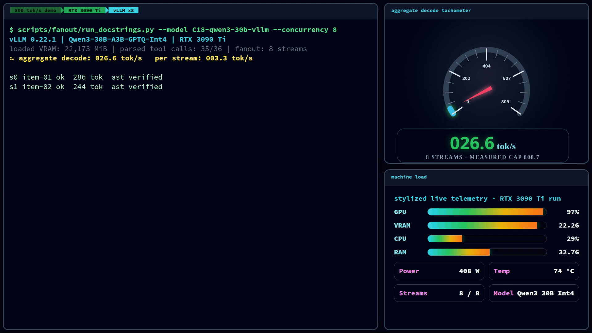
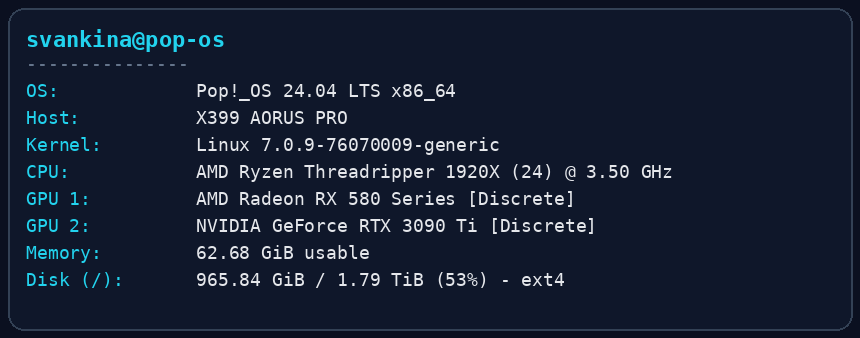

# 1,184 decode tok/s from one RTX 3090 Ti

1,184 aggregate decode tok/s sustained from a single RTX 3090 Ti at 24 vLLM streams — 1,071 at the recommended 16. Qwen/Qwen3-30B-A3B-GPTQ-Int4. Coherent output. Parsed tool calls: 35/36.

Not an autonomous multi-turn worker. A very fast single-shot fan-out engine.



*Measured replay from the x24 capture: 24 refill streams over 129 active seconds, 670.7 tok/s sustained, 1,248.0 tok/s peak, and 52.0 tok/s per stream at the poster frame.*

**The goal**

Parallel local agent workers on one 24 GB card. Single-stream was solved early: byteshape's Qwen3.6-35B-A3B under llama.cpp Vulkan runs 127.7 tok/s with 100% toolcall and 5/5 agentic. One excellent worker. We wanted a pool.

The win was not a pile of model copies. It was one batching server, the right 30B quant, and a narrow lane.

**What gave the wins**

| Lever | Why it mattered | Measured |
|---|---|---|
| vLLM continuous batching | turns independent requests into one saturated decode engine | scaling vs llama.cpp slots: 1.27× → **4.40×** at x8, **5.8×** at x16 |
| Qwen3-30B-A3B GPTQ-Int4 | 15.77 GiB of weights, enough room left for batched KV cache | the only 30B-class quant that loaded — alternatives ran 22–26 GiB |
| `gptq_marlin` | keeps the MoE int4 path fast on a 24 GB card | 183.8 tok/s single-stream |
| `--max-num-seqs 16` | exposes the actual throughput tier instead of queueing inside the client | x8: 808.7 → x16: **1,071** tok/s; sweep below |
| `--max-model-len 16384` | enough context for worker prompts without spending the whole card on KV | 32K OOMed at startup; 16K loads with 56,080 KV tokens |
| no speculative decoding | leaves batching headroom for the live streams | spec on cost −34% aggregate at x4 (llama.cpp CUDA A/B) |
| `--tool-call-parser hermes` | turns Qwen's JSON tool calls into OpenAI `tool_calls` | 0 → **35/36** parsed tool calls |
| `--reasoning-parser qwen3` | separates thinking from visible content so probes and tools work | blank 128-token probes → clean answers |

That's the stack. Text-only Qwen3 MoE, official GPTQ, vLLM 0.22.1, Marlin kernels, 16K context, 16 sequences. Loaded VRAM: 22,173 MiB; 55-56k GPU KV-cache tokens depending on the sequence cap.

**The first number**

Client-measured at the original `--max-num-seqs 8` shape:

| Streams | Aggregate tok/s | Scaling | Per-stream tok/s |
|---:|---:|---:|---:|
| 1 | 183.8 | — | 183.8 |
| 2 | 309.8 | 1.69× | 155.4 |
| 4 | 534.4 | 2.91× | 133.9 |
| 8 | 808.7 | 4.40× | 101.3 |

Throughput used client-measured wall time from OpenAI-compatible usage counts. Tool calls: 35/36 strict. Coherent output, parsed tool calls, all verified.

**Then we asked if eight was the limit**

It wasn't. We swept client concurrency 1→24 against the same server (`--max-num-seqs 32` so it never capped us), measured by the server's own token counter at 1 Hz.

| Streams | Sustained tok/s | Per-stream | Marginal per added stream |
|---:|---:|---:|---:|
| 8 | 730.8 | 91.3 | — |
| 10 | 688.7 | 68.9 | **negative** |
| 12 | 796.7 | 66.4 | +7.8% |
| **16** | **1,071.3** | 67.0 | +8.6% |
| 24 | 1,184.0 | 49.3 | +1.3% |

Ten streams is slower than eight. Not noise — mechanism. vLLM pre-captures CUDA graphs at batch sizes `[1, 2, 4, 8, 16, 24, 32…]` and pads every decode batch up to the next captured size. At 10 streams you run the 16-wide graph with six ghost slots; at 16 every slot is real work. The padding model built from the 10/12 split predicted 1,060 at x16 before we ran it. Measured: 1,071.

So the rule: **run pools at a captured graph size, never between.** The knee is 16 — x24 buys 1.3% per added stream and drops workers below 50 tok/s. New sustained ceiling on this card: **1,071 tok/s, peak second 1,232.** This post was originally titled 808.7. The number was obsolete within a day of measuring it. Good.

**The lane**

This config is for well-specified single-shot fan-out. It is not the senior agent.

The honest caveat: a 3-run agentic variance pass scored 3/5, 1/5, 2/5 — and the same two tasks failed every run. That's systematic, not noise. This config stays off autonomous multi-turn duty. Its job is to chew through independent subtasks fast.

**Proof on real work**

32 real docstring items, 8 streams, 24.7 seconds, 32/32 AST-verified. On short-generation work the sustained number is 345 tok/s average with a 512 peak — prefill and verify gaps eat decode time. The four-digit numbers need long decodes. Full split in the companion piece: [3× faster, 74% cheaper](2026-06-local-subagent-fleet.md).

**Why this matters**

The supervisor can keep the hard parts: planning, review, merges, taste. The local pool gets the boring parallel middle: write this docstring, patch this fixture, extract this structured bit, answer this bounded code question.

Cloud senior -> local fan-out -> deterministic verifier.

Better lane discipline. Less money on grunt work. More tokens where they matter.

**Reproduce it**

vLLM 0.22.1:

```bash
vllm serve Qwen/Qwen3-30B-A3B-GPTQ-Int4 \
  --revision 9b534e4318b7ebc3c961a839f13eb18b1833f441 \
  --max-model-len 16384 \
  --max-num-seqs 16 \
  --gpu-memory-utilization 0.92 \
  --quantization gptq_marlin \
  --enable-auto-tool-choice \
  --tool-call-parser hermes \
  --reasoning-parser qwen3
```

**Hardware**

Bench box, from fastfetch and nvidia-smi:



| Part | Spec |
|---|---|
| Board | X399 AORUS PRO |
| CPU | AMD Ryzen Threadripper 1920X, 12 cores / 24 threads, 3.50 GHz |
| RAM | 62.68 GiB usable |
| Benchmark GPU | NVIDIA GeForce RTX 3090 Ti, 24,564 MiB VRAM |
| Other GPU | AMD Radeon RX 580, 8 GB VRAM |
| Driver | NVIDIA 580.159.03, CUDA 13.0 reported by nvidia-smi |
| OS | Pop!_OS 24.04 LTS, Linux 7.0.9-76070009-generic |
| Storage | 1.8 TiB Sabrent Rocket Q NVMe |

All benchmark numbers above are from the 3090 Ti.

Harness, raw logs, and model SHAs: github.com/svankina/local_agents.

Thanks to [Alok (@analogalok)](https://x.com/analogalok/status/2064002947680485858) for the 26B-on-8GB pointer, [Unsloth AI](https://x.com/UnslothAI/status/2065107734916432189) for the MTP GGUF speedup note, and [Rhonstin](https://inferrank.selfcloud.pp.ua/) for the r/hermesagent 3090 benchmark that pulled byteshape and Qwopus into the matrix.

I've been testing local subagents under Claude Code — the senior plans and reviews, the locals grind. Results next post.

The card came out in 2022.
